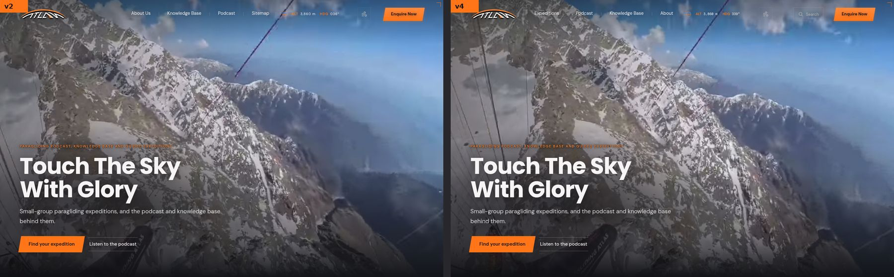
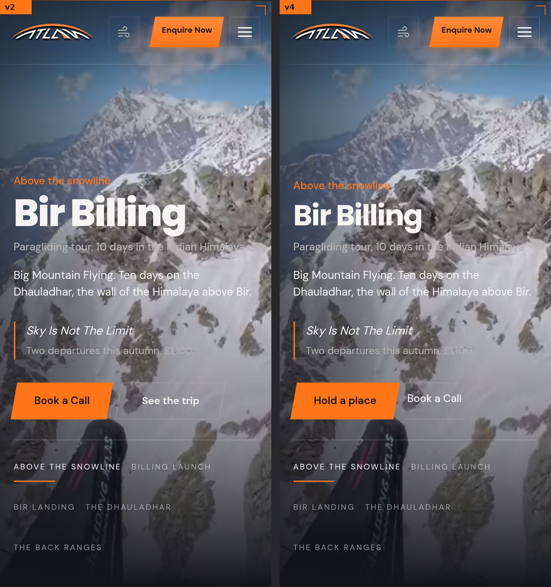
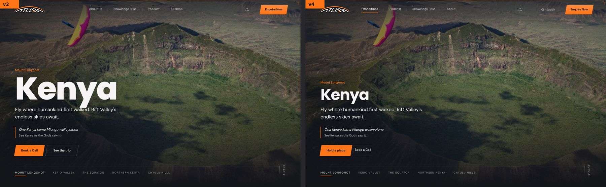
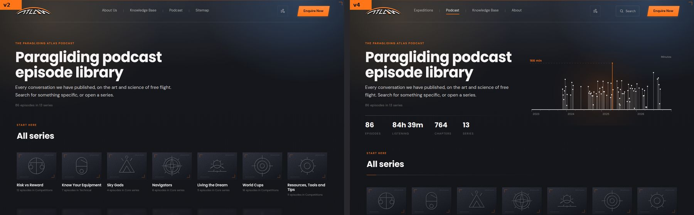
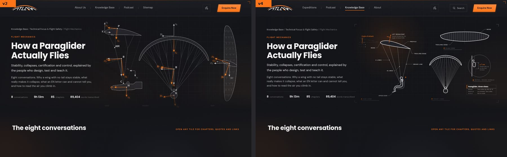
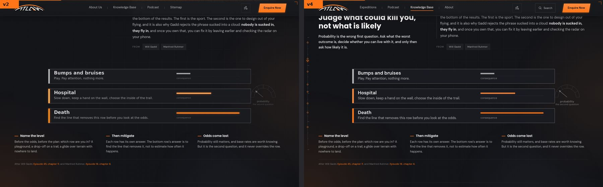
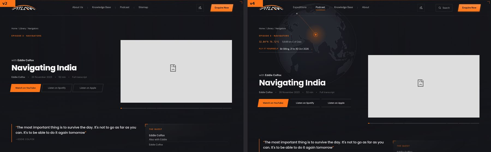
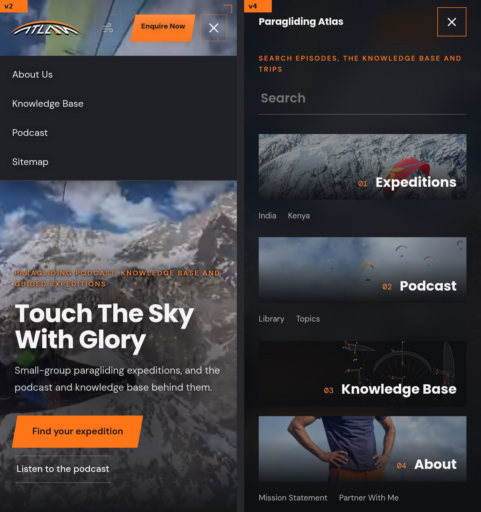

# v4: report of the autonomous build (from 26 Sep 2026)

The brief is `docs/v4-plan.md`. v4 lives in `prototypes/v4/` (hidden,
noindex), previewed at https://paraglidingatlas.com/prototypes/v4/. v2 and
the live site are not changed. v4's rules: `docs/v4-design-rules.md`.

## In short
v4 is ready to look at: https://paraglidingatlas.com/prototypes/v4/ (hidden,
noindex). Steps 0 to 8 of the plan are done, each pushed after every gate
passed. Nothing live and nothing in `prototypes/v2/` changed; `rss-feed.js`
untouched; no switch-over made.

- **One grammar**: three title sizes and one weight, one section head, one
  chip, one button pair, the Arial fix.
- **India and Kenya as fly-throughs**: about 800 words on first read (from
  2,734 and 2,179 measured), every word kept in folds, a trust strip from the
  terms, "Hold a place" on each departure.
- **Signature moments**: the library as a flight log, episodes opening on a
  globe turned to their place, topic logs, cards that open into the page, an
  altimeter, a footage breather, an instrument font for numbers.
- **Navigation**: Expeditions / Podcast / Knowledge Base / About, a
  full-screen menu with photos and one search over 179 pages, a next step at
  the end of every page, bridges between the show and the trips.
- **Speed**: no page heavier than in v2 (India -379 KB, Kenya -160 KB).
- **Drawings**: all 57 knowledge base figures redrawn with the kit, the
  three-view, dials, contours, ridge and icons in the kit's line.

## Before and after
v2 on the left, v4 on the right (`tools/v4_before_after.py`, JPG in
`docs/v4-shots/`, 1.0 MB in all). The video frames are grey where YouTube
is blocked on the build machine.

| | |
|---|---|
| Home |  |
| India on a phone |  |
| Kenya |  |
| Library (the flight log) |  |
| Flight Mechanics (the three-view) |  |
| A knowledge base figure |  |
| An episode (the globe) |  |
| The menu on a phone |  |

## Progress
A check-in reads this table to know where to resume: the first row not
marked done is the next step.

| Step | State | Commit | Gates |
|---|---|---|---|
| 0. Setup: v4 copy, `--site`, v2 byte-identical | done | c649f29 | v4 check 182 pages 0 FAIL; switch v4 180 pages 0 FAIL; audit 0 FAIL; smoke 172 / 0 FAIL; v2 rerun byte-identical |
| 1. Basics: the grammar | done | b0310c7 | all gates PASS (v4 182 pages 0 FAIL, switch 0 FAIL, smoke 0 FAIL, v2 untouched) |
| 2. Drawing kit and the three-view | done (redraws go ahead: step 7) | 63d6a5e | all gates PASS (v4 183 pages 0 FAIL) |
| 3. India, then Kenya | done | edf7a3f | all gates PASS (v4 183 pages 0 FAIL, parity kept on both trips) |
| 4. Signature moments | done (the menu with step 5, KB figures with step 7) | 5be88a9 | all gates PASS (v4 184 pages 0 FAIL) |
| 5. Navigation and wayfinding | done | d5546f5 | all gates PASS (v4 184 pages 0 FAIL) |
| 6. Speed | done | 84258b8 | all gates PASS (v4 184 pages 0 FAIL; switch 0 FAIL after it learnt the deferred image attributes) |
| 7. The remaining redraws | done (poster frame: see notes) | 3ab0e89 | all gates PASS (v4 184 pages 0 FAIL; smoke 0 FAIL on its rerun) |
| 8. The report | done | 8f43896 | all gates PASS (v4 184 pages 0 FAIL, smoke 0 FAIL first run) |

## How to build and check v4
Every `tools/v2_*.py` takes `--site v4` (or `PA_SITE=v4`); without it they
build and check v2 exactly as before (`tools/v2_site.py`).

```
python3 tools/v2_localize.py --site v4        # after editing any v4 page
python3 tools/v2_check.py --site v4           # every v4 page, 390 / 768 / 1440
python3 tools/v2_switch.py --site v4 --dry-run
```

## Needs the owner
(collected as the run goes; nothing here blocks the build)
- **Proof from past clients.** The site has no quotes from trip clients (its
  testimonials are podcast listeners), so both trip pages show "From past
  pilots [to supply]". Send quotes and photos with permission.
- **Booking.** "Hold a place" opens the enquiry (still mailto) with the trip
  and the departure's dates filled in. A deposit link per departure and the
  places left would turn it into a booking.
- **Enquiry follow-up.** An automatic reply and a reminder need a mail
  service (free: Google Apps Script in your Workspace). The form stays mailto.
- **Footage and data.** IGC logs of the filmed flights (the readout's ALT and
  HDG and the flight line would then be real), 5 to 10 s clips per
  destination, a wind or vario recording, photos from past trips.
- **Facts.** Peru and Kazakhstan (length, group size, price); 14 episode
  dates and 2 descriptions (list in `docs/v2-report.md`; the library shows
  "[to supply]" for the missing dates); one episode count (pages say 71, 86,
  93 and 90+); one currency or both (India in GBP, Kenya in USD today).
- **The go.** An iPhone check (Safari items below), then the switch-over,
  v2 or v4. Not done here, as agreed.
- **"The poster frame"** (plan, step 7): which drawing is meant? None in the
  site goes by that name, so it was left as it is.

## Step 0: setup
- `prototypes/v4/` is a copy of v2 (same file names inside). Its scripts find
  their folder with `/prototypes/v\d+/`, so the same files work in v2 and v4.
- `tools/v2_site.py`: `--site v4` (or `PA_SITE=v4`), default v2. Every
  `tools/v2_*.py` uses it for its folder; `v2_switch` also for its assets
  folder (`assets/v4`), its staging copy (`/tmp/claude-0/v4-stage`) and the
  prototype-only pages (styleguide, fly-options, anything under `samples/`).
- The checker now also fails a page that links into another prototype's
  folder, and a v4 script or style sheet that names `prototypes/v2`.
- Proof that v2 is untouched: every v2 generator (episodes `--all`, twins,
  art, icons, fly options, library cards, localize) and `build.sh` rerun with
  the default site; `git status --short prototypes/v2` is empty. The same
  run before the change was also clean, so the tools are deterministic.
- `tools/v4_shots.py`: viewport screenshots walking down a page at 390
  (touch) and 1440, with a contact sheet (`--sheet`).

## Step 1: the grammar
- **Arial fix** in the v4 v2.css: buttons and fields take the page's type (0
  of 72 controls on India still in Arial; were 32).
- **Page titles: three sizes, one weight (700)**, measured on 17 page kinds:
  73.6 px (display, photo heroes), 60.8 px (sky heroes, and the knowledge base
  door, was 70.4), 48 px (episodes and knowledge base articles, was 50.4 and
  48 at 800). Partners, the trip pages and the episodes lose the 800 weight;
  the trip pages' 152 px wordmark is display size until step 3 rebuilds them.
- **One section head**: kicker, title, a hairline with a short orange lead,
  and an optional note on the right (`.kit-note`; the departures' "Small
  groups, fixed dates. Prices are per pilot." is the first).
- **Buttons**: the listen buttons (home, podcast, the call) and the episodes'
  listen links now read as `.btn-solid` / `.btn-lines`.
- **One chip**: the episode topic tags, the partners' interests, the knowledge
  base series tags: soft fill, the chosen one orange.
- **Partners** in the site's scale: section titles 61 px extra-bold -> the
  kit's section size, kickers the kit's, reel tiles and fields soft surfaces.
- **No void before the footer**: the library's and topics' last band keeps a
  short gap; the topics grid is soft tiles (its short last row left a grey slab).
- **Episode titles**: `tools/v4_pass.py` splits 13 long on-screen titles at a
  natural break (the speaker line above, the rest under the title, smaller);
  every word stays in the `<h1>`.
- **Shorter homepage**: five bands (hero, where we fly and every departure,
  the podcast, why and the list); the call moved into the departures band as
  one row, its pitch and list folded; the "why" panels are titles that open.
  Desktop height 9,403 -> 8,865 px; phone 12,366 -> 11,016 px.
- **Less text on first read, every word kept (in `<details>`)**: knowledge base
  sections show title, summary and sources, the long paragraphs under "Read
  more" (62 sections; e.g. Navigators 1,745 words folded); the podcast's
  "What you can expect" panels open from their titles and the two
  collaborate / sponsor panels fold after their first sentence.

## Step 2: the drawing kit and the three-view
- `tools/v4_draw.py`, the kit: inline SVG in the site's type (the drawing
  inherits the page's DM Sans and Poppins); a 2 px outline, 1 px detail,
  0.75 px hairlines and centre lines that keep their width on a phone
  (non-scaling strokes); callouts with leaders, dimension lines with extension
  lines and arrowheads, angle arcs, hatching, Catmull-Rom splines and true
  arcs, view labels, detail circles, a title block, a drawing-sheet frame, and
  a backdrop (a drafting grid that fades out, a soft orange light on the
  subject). A compact mode sets the labels a size smaller for phone layouts.
- `tools/v4_figs.py`, the paraglider three-view: side view (the profile, the
  lines, the pilot facing forward, the speed bar, the angle of attack, the
  lift resultant), front view (the arc and the lines), plan view, and detail D
  (the brake handle, hands fully up and at the first tension). A wide layout
  and a tall phone layout.
- **Nothing invented.** Every label is a word the Flight Mechanics page uses
  (profile, nose, trailing edge, A lines, B lines, brake line, speed bar,
  angle of attack, lift resultant "moves forward as the angle of attack
  falls"). The one number is the page's own: at least 7 cm of brake travel
  from hands fully up to the first tension, Tom Lolies, Episode 66, chapter 12
  (in the title block). No scale: the title block says "Not to scale". The
  old figure's flight-dynamics symbols (K, P, B, AM, x_b, theta_b...) are not
  on the page, so they are gone.
- Before and after: `prototypes/v4/samples/three-view.html` (a v4 sample
  page: hidden, noindex, never switched). **Verdict: clearly better**
  (vector and sharp at any size, legible on a phone, true labels, the site's
  type), so the remaining figures are redrawn in step 7; the originals stay in
  v2.

## Step 3: India, then Kenya
`tools/v4_trip.py` builds both from the v2 pages (read only). The same
components as before, reordered, folded and restyled, so nothing a page
script needs was rewritten.

| | India | Kenya |
|---|---|---|
| Words, v2 page (body) | 4,214 | 3,353 |
| Visible on first read, v2 | 2,734 | 2,179 |
| Visible on first read, v4 | **784** | **659** |
| Body words kept (parity) | 100%+ | 100%+ |

- **The fly-through is the trip's moment**: five full screens, the
  photograph behind, one idea each (India: the launch, the front range, the
  way home, cloudbase, the season; Kenya: the launch, the thermals, the
  horizon, thermal strength, the season). The two new screens use only the
  page's own figures (India 2.4 / 3-3.6 / 5.8 km, Oct to Nov, 1 guide to 3
  pilots; Kenya 1-2 / 4-6 / 6-7 m/s, Dec to Mar, 2 to 7 hrs per flight,
  1,500m AGL) and photographs the site already has, with the site's own alt
  text.
- **Facts, then a trust strip** under the hero: registered in Norway
  (organisasjonsnummer 937116934), package travel rights under Norwegian and
  EU law, refunds within 14 days where due, and the participant agreement's
  "not a waiver of our responsibility to you", each a link to the terms or
  the agreement.
- **"Hold a place"** in the hero, on each departure and in the phone bar;
  it opens `enquire.html?trip=...&when=...` with the trip and dates chosen
  (the v4 enquiry page now reads `when`). Still mailto.
- **Folded, word for word** (`<details>`): the long overview (lede,
  instruments, retrieves, traffic, the sign-off), each route's paragraph,
  the guides' biographies, five of India's ten questions (one of Kenya's
  six), how a day runs and who the trip is for, the travel essentials, the
  packing list, the etiquette, the call's pitch. A link to an anchor inside
  a fold opens it (`#packing`, `#faq`...). Every id other pages link to is
  kept (`#dates`, `#route`, and every section id).
- JavaScript off: every screen readable (`@media (scripting: none)`);
  reduced motion: every screen shown, still.

## Step 4: signature moments
The rule is in `docs/v4-design-rules.md` with each page's one moment.
- **Library: the flight log won.** Every episode a line in a pilot's log
  (number, date, the episode and its guest, series, length, chapters; the
  figures in the instrument font), 24 to a page, the whole library drawn as
  a log above it with a stats row (86 episodes, 84 h 39 m, 764 chapters, 13
  series). The poster wall is `prototypes/v4/samples/library-wall.html`. Why
  the log: its pictures are YouTube stills of every style, many with their
  own text, so a wall of them is noisy under our titles; the log is legible,
  fits the instrument look, and keeps every word as text. (The stills are
  blocked in this environment, so the wall could only be judged on its
  structure: worth a look on the live preview.)
- **Episodes open on a globe turned to where the story is from** (72 of 93:
  those whose pin on the podcast globe is a real place; the others keep the
  usual opening). Drawn at build time from Natural Earth (public domain), no
  d3 on the page (about 10 KB compressed), with the coordinates, range and
  bearing from Oslo in the instrument font, as the podcast globe's popup
  gives them.
- **Topics**: the knowledge base's header pattern: a stats row
  (conversations, listening time, chapters, series) and a drawing that is the
  topic's own log (one bar per conversation by date, as tall as it is long);
  a featured row of the three newest (a swipe strip on a phone).
- **Cards open into the page**: an episode card's picture (or the popup's)
  grows into the episode's player (cross-document view transition; plain
  navigation where not supported; off under reduced motion). Verified in
  Chromium: the transition runs on arrival.
- **The altimeter**: a tape down the left edge of long pages, a ring at each
  section, the glider descending as you read (decoration, aria-hidden, wide
  screens, off under reduced motion).
- **Footage breather**: the podcast's opening line now sits over the site's
  own hero loop, full screen (plays only while on screen).
- **The instrument font**: DM Mono (OFL, self-hosted in `prototypes/v4/fonts/`,
  subset, 8.9 KB a weight, licence beside it); specimen in the v4 style
  guide; applied to the readout, coordinates, timestamps and chapter times,
  durations, trip readouts and stats. The outlined numerals stay.

## Step 5: navigation and wayfinding
- **The header** (decision 5): Expeditions, Podcast, Knowledge Base, About,
  then Enquire Now; the current section underlined in orange
  (`aria-current`). Sitemap is in the footer (and in the menu). Fitted at
  every width from 821 to 1440 px (checked for overflow at 1440, 1280, 1180,
  1024, 900 and 821).
- **The full-screen menu with photos**: the search button in the header, and
  the menu toggle on a phone, open it: the four sections as photographs
  (loaded only when it opens) with their sub-pages (India, Kenya; Library,
  Topics; Mission Statement, Partner With Me), Enquire Now and Sitemap. Focus
  stays inside; Escape closes it and gives focus back.
- **One search** across episodes, the knowledge base, trips and topics:
  `prototypes/v4/search-index.js` (`tools/v4_search.py`, 179 pages, the
  pages' own titles and descriptions, 42 KB, loaded when the search is first
  used).
- **Every page ends on one clear next step**, in the site's own words: the
  text pages on "Book a free 30-minute, no obligation virtual call", the
  library on Topics, a topic on the full episode library.
- **Bridges**: trip pages keep "Hear Bir from someone who flies it" (from the
  show); episodes whose place is within 400 km of a trip say "Fly it
  yourself" with the trip's next dates (Navigating India with Eddie Colfox
  and with Jigish Gohil, Pre PWC Kenya...).
- **The wind button says what it is**: "Wind sound" beside the icon where
  there is room (always in its label for screen readers).
- **Phone bars**: the trip pages' "Hold a place" bar (step 3); episodes get
  Play (starts the audio, or brings the video into view) and Next (the first
  of "Up next").

## Step 6: speed
Bytes on arrival (`python3 tools/v4_weight.py`: Chromium at 1440 x 900, the
network settled, text compressed as GitHub Pages serves it, the blocked
YouTube and feed hosts left out of both):

| Page | v2 | v4 | |
|---|---|---|---|
| Home | 2,215 KB | 2,214 KB | -0 KB |
| Podcast | 605 KB | 544 KB | -61 KB |
| Library | 243 KB | 243 KB | -0 KB |
| About | 2,053 KB | 2,053 KB | -0 KB |
| India | 3,934 KB | 3,555 KB | -379 KB |
| Kenya | 1,310 KB | 1,150 KB | -160 KB |
| Knowledge base | 1,176 KB | 1,173 KB | -3 KB |
| Flight Mechanics | 322 KB | 320 KB | -3 KB |
| Topic: Safety | 189 KB | 187 KB | -1 KB |
| Episode (Eddie Colfox) | 222 KB | 219 KB | -2 KB |
| Episode (Damien Lacaze) | 373 KB | 370 KB | -2 KB |
| Terms | 178 KB | 175 KB | -3 KB |

No page is heavier than its v2 twin; home is under 2.5 MB. How:
- **The podcast globe loads when it comes near** (d3, topojson, the pins
  and globe.js through one observer), not on arrival.
- **The trips' fly-through photos load when their screen comes near**
  (`data-v4-src`), not with the page.
- **Readable sources, served minified**: `prototypes/v4/src/` keeps the
  commented CSS and scripts; `tools/v4_min.py` writes the served copies.
- **The instrument font is split** (digits 2.7 KB, letters on demand by
  unicode-range); the unused weight was removed.
- **The menu's code loads on first use** (`v4-menu.js`); the search index
  when the search is first used.
- **The list of pages without a v4 twin** is written into v2.js at build
  time, not fetched.
- **Drawings**: runs of the same stroke merged into one path.

## Step 7: the remaining redraws
- **The 57 knowledge base figures, redrawn with the kit.** `tools/v4_kbsvg.py`
  runs each original figure script (`tools/kbfig/*.py`, `tools/make_kb_*.py`)
  unchanged, with the kit standing in for matplotlib: the same geometry,
  labels and numbers (all checked against the pages when they were made), now
  vector, in the site's type, with the kit's line weights (hairlines that keep
  their width at any size) and a soft light where the old glow was. Written to
  `prototypes/v4/img/kb/`. Each figure was compared side by side with its
  original.
- **Placed in the pages** by `tools/v4_pass.py`: inline where the drawing is
  small or carries words (the site's own fonts), a lazy `` where it is
  large and wordless (one: the Flight Mechanics cutaway). The alt text is kept
  as the drawing's title, the captions as they were, each page's og:image
  untouched (the rasters stay in `assets/images/` for v2 and for sharing).
- **Flight Mechanics opens on the kit's three-view** (step 2), labelled with
  the page's own words and the one dimension Tom Lolies gives (Ep. 66, ch. 12).
- **Lighter**: 245 KB of drawings against 1,802 KB of pictures (compressed as
  served); every knowledge base page weighs less on arrival than in v2
  (Flight Mechanics -43 KB, Meteorology -49 KB, Storytellers -46 KB).
- **Maps**: the world maps keep the original's Natural Earth 1:110m country
  outlines (public domain), with a copy of the land outlines in `tools/data/`
  as a fallback when the build machine is offline.
- **The trip dials** (season and vario): finished with the kit's hairlines, an
  inner ring with the month boundaries and half-step ticks. No new values.
- **Contours and ridge** (`tools/v2_art.py --site v4`) and the **panel and
  series icons**: the kit's hairline weights, constant at any size. v2's files
  are unchanged.
- **The Kenya chart**: already drawn as a technical sheet, kept. Fixed in the
  preview: its relief picture and the site photos in its panels were named
  from the live page's folder and did not load inside `prototypes/`, which
  showed as a smeared colour layer on the chart (v2 has the same fault; v2 is
  left as it is). Live and after the switch-over, the paths work.
- **The smoke test's pinch check** failed twice on this run, on the live
  Kenya map (unchanged). It failed on the already-pushed step 6 tree as well
  (2 runs in 6): its first pinch moved every 45 ms, faster than the page's
  frames under load, so the gesture sometimes never registered. It now moves
  at a person's pace (90 ms) and waits for the zoom to settle; 0 failures in
  6 runs. No check was removed or loosened.
- **Not done: "the poster frame".** The plan names it without saying which
  drawing it is, and none in the site is called that; listed under Needs the
  owner.

## Step 8: the report
- This report, the before and after pictures above
  (`tools/v4_before_after.py`), sent to the owner as well.

## The switch-over, if v4 is chosen
`tools/v2_switch.py --site v4 --apply --out _site` builds the live site from
v4 (dry run: 180 pages, 0 FAIL). It copies v4's own files to `assets/v4/`
(v2.css, v2.js, v2-immersive.js, v4-menu.js, search-index.js, fonts, img,
the knowledge base drawings in img/kb) and points every page at them. The
deploy workflow draft (`docs/v2-deploy-workflow.yml`) runs the same steps
with `--site v4`, with v4's generators between v2_twin and v2_localize:

```
python3 tools/v2_episode.py --site v4 --all
python3 tools/v2_twin.py --site v4
python3 tools/v2_library_cards.py --site v4 && python3 tools/v4_library.py
python3 tools/v4_trip.py
python3 tools/v4_kbsvg.py            # only when a figure script changes
python3 tools/v4_pass.py
python3 tools/v4_search.py
python3 tools/v4_min.py
python3 tools/v2_localize.py --site v4
./build.sh
```
The Kenya chart's preview fix (step 7) switches itself off outside
`prototypes/`.

## To check on an iPhone (Safari)
Chromium was the only browser here. Worth a look in Safari:
- the cards opening into the page (view transitions: Safari 18.2 and later;
  older versions navigate plainly, as intended);
- the full-screen menu: focus, the close button, scrolling inside it;
- the knowledge base heroes on a phone (the drawings sized with
  `aspect-ratio`) and the wide figures' sideways scroll;
- the instrument font's split files (unicode-range);
- the episode Play / Next bar and the trips' Hold a place bar above Safari's
  toolbar;
- pinch on the Kenya map, and the chart's relief.

## Follow-up (after step 8)
Five things done without the owner, each through the gates:
- **Tap targets.** The v4 check's warnings were almost all "tap targets under
  40px" on a phone. Fixed where v4 made them: the next step at the end of
  each page, the knowledge base's category titles, the sitemap's two
  buttons. The rest (about 78) are the chapter ticks on episode timelines,
  exactly as in v2: a ten-chapter timeline cannot give each tick 40px on a
  phone, and every chapter is also a full-size link below it. Kept.
- **The last old pictures.** The knowledge base index paints each category
  with the kit's drawing, and the menu's Knowledge Base tile shows the
  three-view (`img/kb/kb-flight-mechanics.svg`).
- **The gallery drag check** (smoke) re-aims until the gallery is under the
  pointer before pressing: photographs above it loading late had pushed it
  away at random. 0 failures in 6 runs. Nothing loosened.
- **`docs/v4-deploy-workflow.yml`**, a draft, not active: the v2 draft with
  `--site v4` and v4's steps. Checked: the sequence rebuilds all 184 v4 pages
  byte for byte on a clean checkout, and the switch writes 180 pages with
  everything they load in `assets/v4/`. The readable sources (`src/`) are
  now kept out of the published site.
- **Every page type walked** screen by screen at 390 (touch) and 1440: home,
  podcast, library, about, mission, partners, enquire, sitemap, terms,
  topics, a topic, a knowledge base page, an episode with and without a
  globe. No sideways overflow, no script errors. One fault found and fixed:
  in the library's flight log on a phone, v2's stronger rule kept the
  chapter count showing, which squeezed the title to 74px and printed the
  episode number over its length.

## Polish (owner: "keep polishing v4")
- **Readability.** Every text on eleven key pages measured against its real
  background (WCAG AA: 4.5:1 for small text). The secondary grey (#737373,
  3.85:1) failed wherever it was used: timestamps, labels, notes, bylines.
  v4 lifts the token to #8c8c8c (5.4:1; 5.0:1 on cards) in its own style
  sheet (`styles.css`, the live file, is untouched), and the drawings' view
  labels with it. What is left are false alarms (the "|" separators in the
  header, outlined numbers, text on the orange buttons).
- **Hero figures on a phone.** The podcast's "80+" fell to a line of its own;
  the three figures now share one line down to 360px, as on the home page.
- **Keyboard.** Tabbing through six pages: every stop shows focus (fields turn
  orange, links get an outline).
- **Walked** India, Kenya, the knowledge base index and three more knowledge
  base pages at both widths; reduced motion on Kenya.
- **A pass fix.** The three-view's markup names its attributes in another
  order, so the pass never refreshed it after a kit change; it does now.
- **Known, left as is (no JavaScript):** the trips' later fly-through photos
  load on scroll (step 6), so without JavaScript the first photo stays behind
  every screen, and v2's route diagram stays half drawn. All the words are
  there; visitors without JavaScript are rare.
